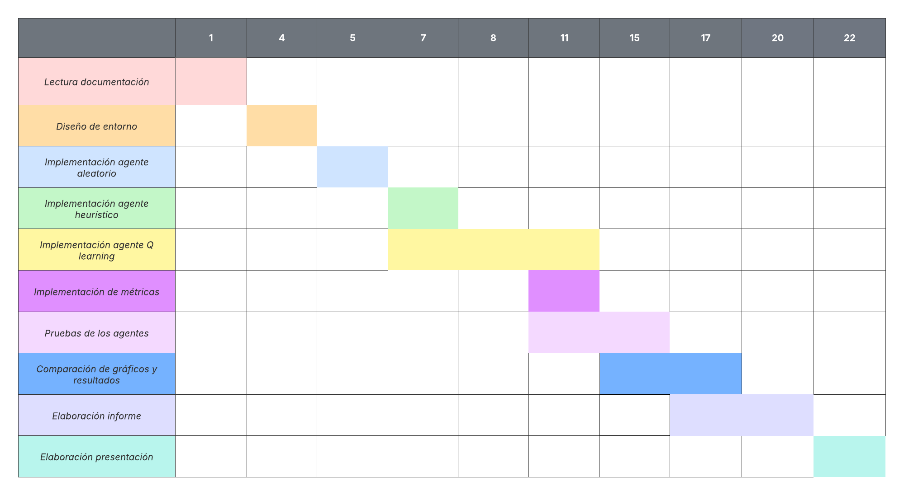

# **Anteproyecto Final – Inteligencia Artificial**

## **Agente de Reinforcement Learning para Balatro**

**Código del proyecto:** BALATRO-RL
**Integrantes:** *Luciana Puentes*
**Año:** 2025

---

## **1. Descripción General**

El proyecto consiste en desarrollar un **agente de Inteligencia Artificial capaz de jugar Balatro** utilizando técnicas de **Reinforcement Learning (RL)**.
Balatro es un *roguelike deckbuilder* basado en la formación de manos de póker para superar rondas llamadas *ciegas* y, cada tres ciegas, un *mini-jefe* denominado **Boss Blind**. El objetivo final es **vencer la ciega jefe final (Boss Blind número 9)** y ganar la partida.

Dado que Balatro no posee una API oficial ni un entorno Gym listo para RL, se desarrollará una **simulación simplificada del juego**, con las reglas necesarias para:

* Representar manos válidas de póker.
* Calcular puntajes según multiplicadores, incluyendo jokers y cartas planeta.
* Simular rondas y jefes (ciegas normales y Boss Blinds).
* Proveer un entorno con estados, acciones y recompensas.

El trabajo se centrará en comparar **tres agentes**:

1. **Agente Aleatorio (baseline).**
2. **Agente Heurístico Simple** (prioriza construir manos fuertes).
3. **Agente con Q-Learning**.

---

## **2. Objetivo del Proyecto**

El objetivo principal es:

### **Desarrollar un agente de RL que aprenda a jugar Balatro y sea capaz de vencer la ciega jefe final.**

Además, se pretende:

* Comparar el desempeño entre los tres agentes propuestos.
* Diseñar una función de recompensa adecuada al dominio del juego.
* Analizar métricas como supervivencia, puntaje acumulado y éxito en bosses.
* Obtener conclusiones sobre la efectividad del enfoque basado en Q-Learning para un juego estratégico por turnos.

---

## **3. Alcance**

El alcance del proyecto incluye:

- Simulación básica del entorno de Balatro (estado, acciones, recompensas).
- Implementación de agentes **Random**, **Heurístico** y **Q-Learning**.

El alcance no incluye:

- Un simulador completo idéntico al Balatro real.
- Cartas especiales avanzadas (jokers complejos, boosters, sellos especiales, tarots).


---

## **4. Agentes a Implementar**

### **4.1. Agente Aleatorio (Baseline)**

* Selecciona cartas aleatoriamente para formar una mano.
* Sirve como punto de comparación mínimo.

### **4.2. Agente Heurístico Simple**

* Prioriza formar manos fuertes.
* Regla base:

  > Si es posible formar **Escalera**, elegir esa mano.
* Si no, prioriza otros valores de póker (Póker > FullHouse > Color > Trío etc).
* No aprende: sus decisiones están preprogramadas.

### **4.3. Agente Q-Learning**


* Política ε-greedy.

* Estados considerados:

  * Cartas disponibles en mano.
  * Tipo de mano potencial.
  * Puntaje actual vs puntaje requerido para la ronda.
  * Ronda actual (normal o Boss Blind).

* Acciones: Selección de combinaciones de cartas válidas para jugar.

* Recompensas: Basadas en progreso estructurado del run:

  ```
  +10 por superar una ciega.
  +50 por superar un Boss Blind.
  +200 por vencer la ciega jefe final.
  -10 por perder la ronda.
  +puntaje_normalizado por cada mano jugada.
  ```
## **4.4. Entrenamiento**

Siguiendo la metodología típica de Q-Learning , el agente se entrenará mediante un proceso iterativo, alternando fases de aprendizaje y prueba para observar su mejora progresiva:

- Entrenamiento 1:

    - 1000 episodios donde la tabla Q se actualiza dinámicamente.

    - Luego, 100 episodios de testeo sin actualización (tabla Q fija).

- Entrenamiento 2:

  - 2000 episodios de entrenamiento.

  - 100 episodios de testeo con la tabla Q fija.

- Entrenamiento 3:

  - 3000 episodios de entrenamiento.

  - 100 episodios de testeo con la tabla Q fija.

- Entrenamiento 4:

  - 4000 episodios de entrenamiento.

  - 100 episodios de testeo con la tabla Q fija.


## **5. Métricas**

Se utilizarán las siguientes métricas para comparar Random, Heurístico y Q-Learning:

1. **Ganó la partida:**

   * % de runs donde vence al Boss Blind final.

2. **Supervivencia (ronda máxima alcanzada):**

   * Ciegas superadas.
   * Boss Blinds superados (cada 3 rondas).

3. **Puntaje total de cada run.**

4. **Recompensa acumulada del agente RL.**

5. **Comparación directa:**

   * Gráficos:

     * Puntaje promedio.
     * Rondas superadas.
     * Tasa de victoria.
     * Recompensa promedio.

Las métricas se recopilarán durante múltiples ejecuciones.

---

## **6. Herramientas**

* **Python 3.10+**
* **Entorno de simulación propio (Balatro-Sim)**
* **Numpy**
* **Matplotlib** (gráficos)
* **Random**
* **Q-Table en diccionarios o matrices**

---

## **7. Justificación**

Balatro representa un entorno interesante de RL por:

* Tener un **espacio de decisiones discreto**, adecuado para Q-Learning.
* Utilizar **recompensas densas**, lo cual acelera el aprendizaje.
* Poseer un equilibrio entre **azar y estrategia**, ideal para comparar agentes simples vs RL.
* Ser un juego por *episodios*.

Además, modelar Balatro requiere crear un entorno propio, lo cual aporta experiencia valiosa para simuladores de juegos con reglas complejas.

---

## **8. Listado de Actividades**

| Actividad                                                 | Duración Estimada |
| --------------------------------------------------------- | ----------------- |
| Lectura de documentación de RL (AIMA, material del curso),|                   |
|                               póker y del juego Balatro   | 1 día             |
| Diseño del entorno Balatro-Sim                            | 4 días            |
| Implementación del agente aleatorio                       | 1 día             |
| Implementación del agente heurístico                      | 2 días            |
| Implementación de Q-Learning                              | 4 días            |
| Definición de métricas                                    | 1 día             |
| Pruebas de los agentes                                    | 4 días            |
| Comparación de resultados y gráficos                      | 2 días            |
| Elaboración del informe final                             | 3 días            |
| Presentación y diapositivas                               | 2 días            |

---

## **9. Cronograma Gantt**




## **10. Referencias**

### **Balatro**

* Balatro Wiki: [https://balatrogame.fandom.com/wiki/Balatro_Wiki](https://balatrogame.fandom.com/wiki/Balatro_Wiki)
* Ciegas y Boss Blinds: [https://balatrogame.fandom.com/wiki/Blinds](https://balatrogame.fandom.com/wiki/Blinds)

### **Reinforcement Learning**

* AIMA – Capítulo 21: [https://aima.cs.berkeley.edu/](https://aima.cs.berkeley.edu/)
* Sutton & Barto – *Reinforcement Learning: An Introduction*
* Hands-On Reinforcement Learning with Python – Sudharsan Ravichandiran

### **Q-Learning**

* Watkins & Dayan (1992) – Q-learning
* Tutorial simple: [https://www.geeksforgeeks.org/q-learning-in-python/](https://www.geeksforgeeks.org/q-learning-in-python/)

### **Heurísticas y reglas de póker**

* Poker hands: [https://en.wikipedia.org/wiki/List_of_poker_hands](https://en.wikipedia.org/wiki/List_of_poker_hands)

### **Implementaciones de referencia**

* RL Examples: [https://github.com/dennybritz/reinforcement-learning](https://github.com/dennybritz/reinforcement-learning)
* Lógica de póker (Deuces): [https://github.com/worldveil/deuces](https://github.com/worldveil/deuces)

