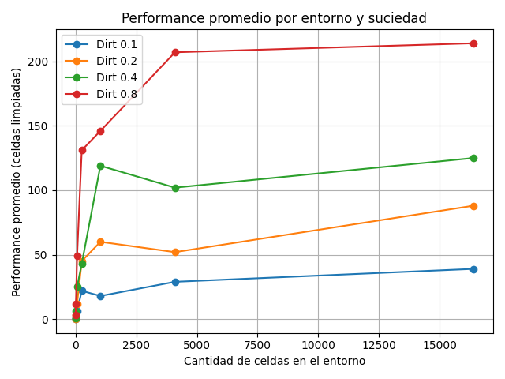
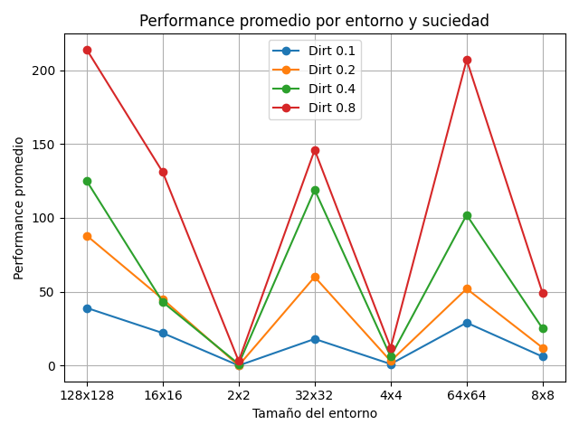
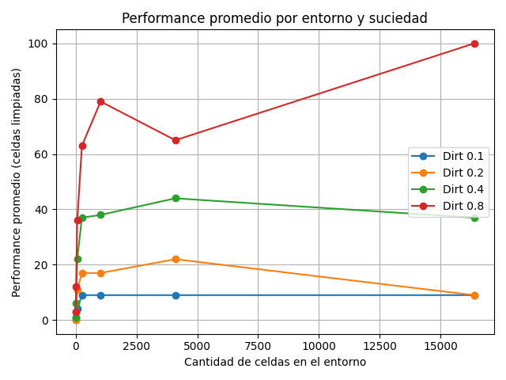
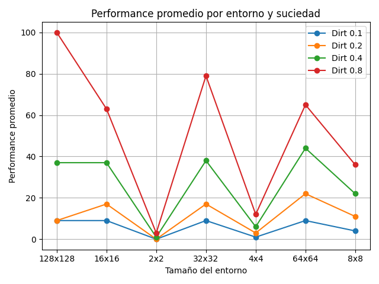
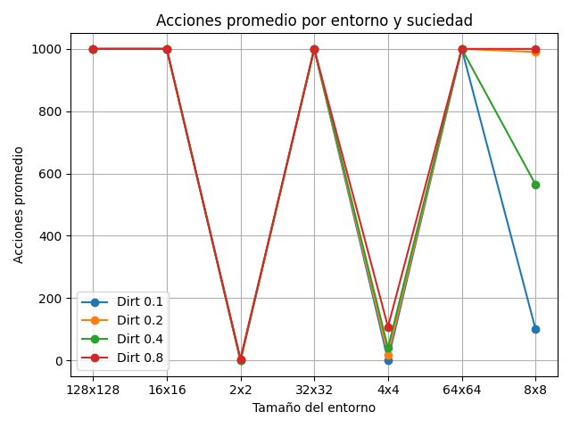
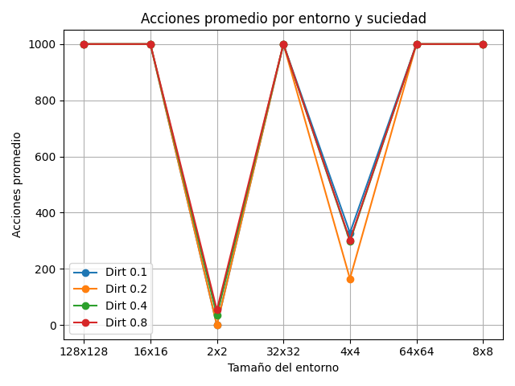
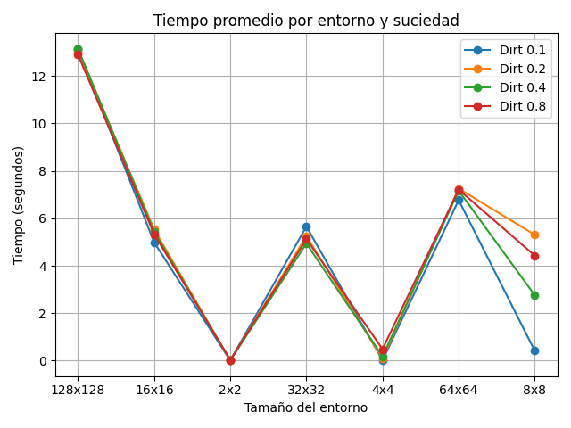
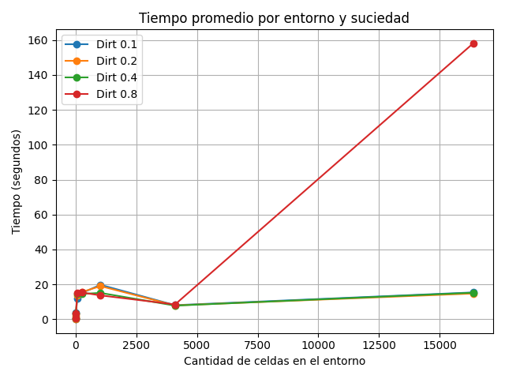
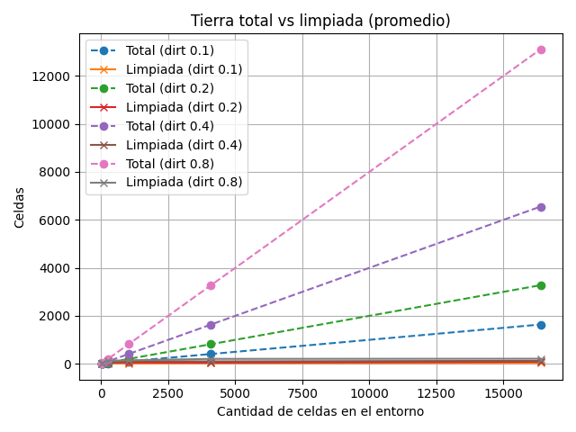
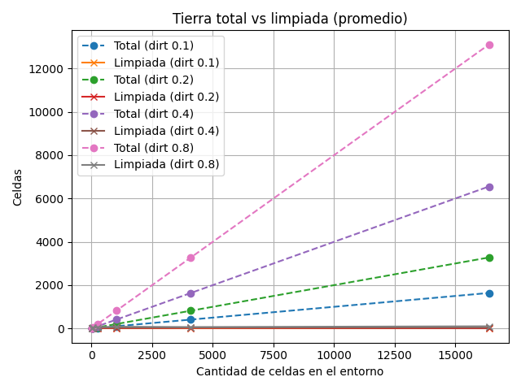

# Informe Comparativo – Agentes Reflexivo vs Aleatorio en el Mundo de la Aspiradora

## 1. Introducción  
El presente trabajo analiza y compara el desempeño de dos agentes en el problema del **mundo de la aspiradora** (Russell & Norvig):  

- **Agente Reflexivo**: actúa en función de reglas predefinidas basadas en la percepción actual. Para este caso particular se utiliza la siguiente estrategia: _"Limpia si está sucio. Se mueve abajo o a la derecha si la fila y columna son pares, si son impares se mueve a la izquierdo o arriba, sino elige al azar"_.
- **Agente Aleatorio**: selecciona acciones de manera no determinista, sin un criterio basado en el estado del entorno.

El objetivo fue observar cómo varía su rendimiento en entornos de distinto tamaño y suciedad inicial, y determinar cuál estrategia es más eficiente y escalable.  

---

## 2. Metodología  
- **Entornos**: cuadrículas de `2x2`, `4x4`, `8x8`, `16x16`, `32x32`, `64x64` y `128x128`.  
- **Niveles de suciedad inicial**: `10%`, `20%`, `40%` y `80%`.  
- **Agentes evaluados**: Reflexivo y Aleatorio.  
- **Repeticiones**: 10 corridas por configuración y agente.  
- **Métricas medidas**:  
  - **Performance** (celdas limpiadas).  
  - **Acciones totales**.  
  - **Tiempo de ejecución**.  
  - **Comparación entre tierra total vs limpiada**.  
- **Análisis**: promedios y comparaciones gráficas con `pandas` y `matplotlib`.

---

## 3. Resultados  

### 3.1. Performance promedio  
Se observa que:  
- El agente reflexivo limpia consistentemente más celdas que el agente aleatorio.  
- Al aumentar el tamaño del entorno, el rendimiento del agente aleatorio disminuye significativamente. Esto se debe a que todas las acciones del agente son elegidas de manera aleatoria, incluyendo moverse a una celda ya limpia o intentar limpiar una celda. En entornos pequeños, la probabilidad de que una acción aleatoria resulte en una limpieza efectiva es relativamente alta, pero a medida que el número de celdas crece, la probabilidad de que el agente seleccione y limpie una celda sucia disminuye proporcionalmente. Por lo tanto, el agente aleatorio realiza muchas acciones ineficaces, lo que explica la caída de performance en entornos grandes.

   
  <b>Figura 1:</b> Performance promedio de agente reflexivo.

   
  <b>Figura 2:</b> Performance promedio de agente reflexivo.

   
  <b>Figura 3:</b> Performance promedio de agente aleatorio.

   
  <b>Figura 4:</b> Performance promedio de agente aleatorio.

---

### 3.2. Acciones promedio    
- El agente reflexivo ejecuta una cantidad de acciones más acorde con la tarea de limpieza, mientras que el aleatorio realiza más movimientos innecesarios. 
- También es importante destacar que para los dirt rates de 0,4 y 0,8 el agente reflexivo en entornos mayores a 4x4 consume todas las acciones. 

   
  <b>Figura 5:</b> Promedio de acciones ejecutadas por el agente reflexivo.

   
  <b>Figura 6:</b> Promedio de acciones ejecutadas por el agente aleatorio.

---

### 3.3. Tiempo promedio de ejecución  
- Ambos agentes presentan tiempos de ejecución que crecen con el tamaño del entorno.  
- Hay una marcada diferencia entre los tiempos de ejecución de ambos agentes, el agente aleatorio muestra tiempos de ejecución mayores a dos minutos para grandes entornos mientras que el agente reflexivo presenta tiempos menores a 14 segundos para dichos casos. 

   
  <b>Figura 7:</b> Tiempo promedio de ejecución del agente reflexivo según tamaño del entorno.

   
  <b>Figura 8:</b> Tiempo promedio de ejecución del agente aleatorio según tamaño del entorno.

---

### 3.4. Tierra total vs limpiada  
- El agente reflexivo se acerca mucho más a la curva de suciedad total, especialmente en entornos pequeños y medianos.  
- A medida que los entornos se hacen más grandes, la diferencia se vuelve mayor. Ninguno de los agentes se acerca a la cantidad total de tierra a limpiar.

   
  <b>Figura 9:</b> Comparación de tierra total vs celdas limpiadas por agente reflexivo.

   
  <b>Figura 10:</b> Comparación de tierra total vs celdas limpiadas por agente aleatorio.

---

## 4. Conclusiones  

- El agente reflexivo logra limpiar más celdas con menos acciones, mostrando un comportamiento más eficiente y estable en entornos pequeños y medianos.
- El agente aleatorio solo logra desempeños aceptables en entornos pequeños y con baja suciedad, pero no escala a escenarios más grandes.

- Ambos agentes son ineficientes en entornos grandes o medianos con alto porcentaje de suciedad.
- Los resultados confirman la importancia de **incorporar estrategias basadas en percepciones y reglas** frente a la aleatoriedad pura.  
- Como trabajo futuro, se podrían comparar con agentes **basados en objetivos** o con **aprendizaje**, para ver si logran aún mayor eficiencia y escalabilidad.
