# Informe Comparativo de Algoritmos de Búsqueda en Entornos Estocásticos

## 1. Introducción

El objetivo del trabajo fue evaluar distintos algoritmos de búsqueda en un entorno **100x100 determinista**, generado con una probabilidad del **92% de celdas transitables (Frozen)** y un **8% de obstáculos (Holes)**.  

Se compararon los siguientes algoritmos:
- Búsqueda Aleatoria
- Búsqueda por Anchura (BFS)
- Búsqueda por Profundidad (DFS)
- Búsqueda por Profundidad Limitada (DLS, límites 50/75/100)
- Búsqueda de Costo Uniforme (UCS)
- Búsqueda A* (con heurística admisible y consistente)

Se consideraron **dos escenarios de costos**:
- **Escenario 1**: todos los movimientos con costo = 1.
- **Escenario 2**: moverse izquierda/derecha = 1, moverse arriba/abajo = 10.

Cada algoritmo se ejecutó **30 veces** con distintas semillas, sobre los mismos entornos generados.

---

## 2. Métricas evaluadas

1. **Cantidad de estados explorados**  
2. **Cantidad de acciones tomadas (longitud del camino)**  
3. **Costo total de la solución**  
4. **Tiempo empleado (segundos)**  
5. **Secuencia de estados (solo en casos exitosos)**  

---

## 3. Resultados Gráficos

### 3.1 Boxplots de Estados Explorados

- BFS (Breadth-First Search) explora un número elevado de estados porque visita todos los nodos de un nivel antes de pasar al siguiente. Esto garantiza que encontrará la solución más corta en términos de cantidad de pasos si existe, pero implica explorar muchas posiciones que no contribuyen directamente a alcanzar el objetivo. Su comportamiento genera una gran cantidad de estados explorados y un mayor uso de memoria, especialmente en mapas grandes o con alta ramificación.

- UCS (Uniform Cost Search) también tiende a explorar muchos estados, aunque su enfoque es diferente: busca minimizar el costo total de la solución en lugar de la cantidad de pasos. Esto significa que puede explorar caminos más largos o complejos si estos ofrecen menor costo acumulado. UCS garantiza encontrar la solución de costo mínimo, pero a expensas de recorrer muchos nodos que podrían parecer menos prometedores inicialmente.

- DFS (Depth-First Search) explora menos estados que los algoritmos anteriores porque se adentra rápidamente en una rama antes de retroceder. Esto puede ser útil para ahorrar memoria y tiempo en mapas grandes, pero tiene un riesgo importante: puede desviarse hacia ramas largas o sin salida, lo que hace que muchas veces no encuentre una solución, o que la solución encontrada no sea óptima en términos de costo o pasos. Su eficiencia depende mucho de la estructura del espacio de búsqueda.

- A* (A-Star) logra un balance entre eficiencia y optimalidad. Explora menos estados que BFS y UCS porque utiliza una heurística para estimar la distancia al objetivo y priorizar los nodos más prometedores. En este caso, la heurística utilizada es la distancia Manhattan entre el estado actual y el objetivo, lo que permite guiar la búsqueda de manera inteligente. A* garantiza soluciones óptimas siempre que la heurística sea admisible (nunca sobreestima el costo real) y consistente, logrando un compromiso entre costo y exploración de nodos.

- Búsqueda aleatoria es la menos eficiente de todas. Al seleccionar el siguiente nodo de forma completamente aleatoria, explora una gran cantidad de estados de manera poco dirigida, lo que genera altos costos computacionales y poca probabilidad de encontrar una solución, especialmente en espacios grandes o con obstáculos. Su comportamiento es útil únicamente en problemas donde no se dispone de información heurística y no importa la eficiencia.

  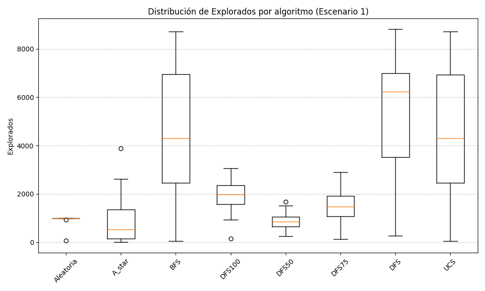 
  <b>Figura 1:</b> Boxplot de estados explorados en el escenario 1

   
  <b>Figura 2:</b> Boxplot de estados explorados del escenario 2

  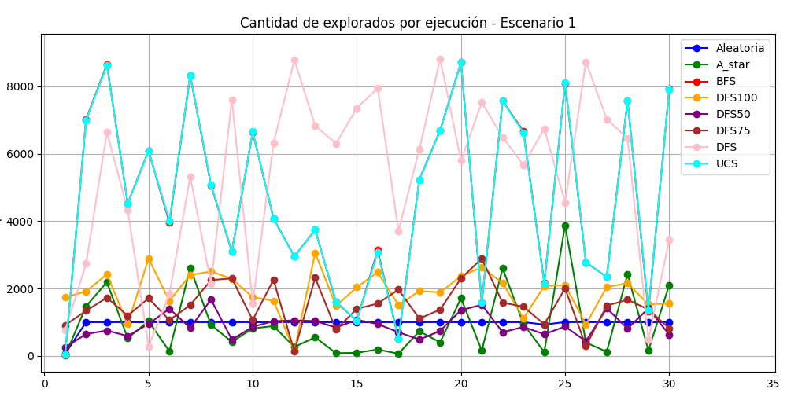 
  <b>Figura 3:</b> Gráfico de estados explorados del escenario 1

  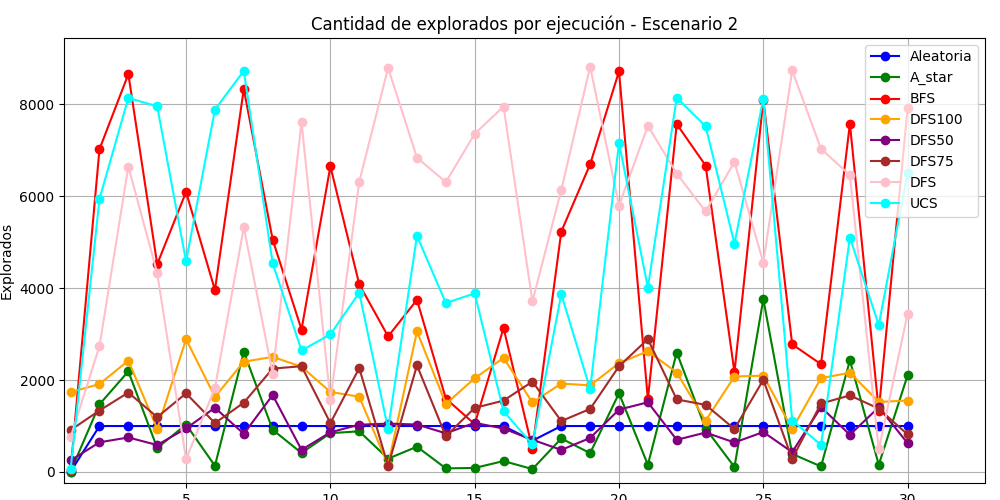 
  <b>Figura 4:</b> Gráfico de estados explorados del escenario 2

  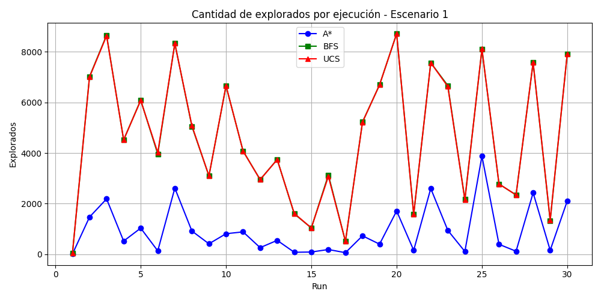 
  <b>Figura 5:</b> Gráfico de estados explorados del escenario 1 para A*, UCS y BFS

  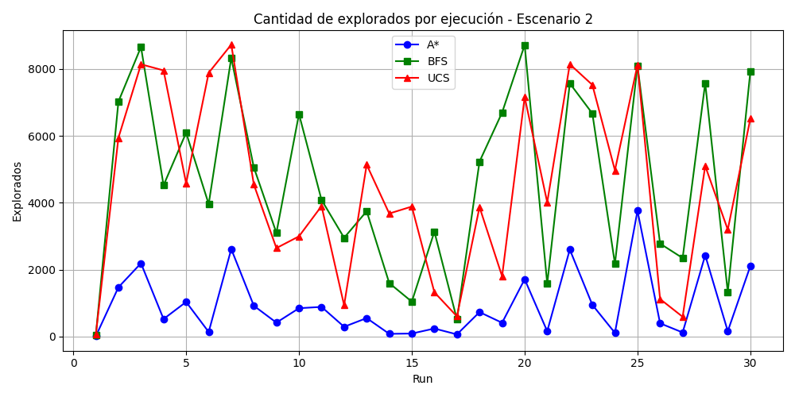 
  <b>Figura 6:</b> Gráfico de estados explorados del escenario 2 para A*, UCS y BFS

---

### 3.2 Boxplots de Pasos (longitud de camino)

- En el **escenario 1 (costos uniformes)**, BFS, UCS y A* tienden a coincidir en la cantidad de pasos. DFS realiza más pasos porque su estrategia lo fuerza a explorar ramas completas antes de retroceder. Esto genera caminos más largos y soluciones menos eficientes, con alta variabilidad en comparación con los demás algoritmos exceptuando la búsqueda aleatoria. Los algoritmos DLS realizan menos pasos que DFS debido al límite de profundidad, lo que hace que explore menos ramas, si bien esto descarta muchas ramas sin solución es posible perder soluciones de igual forma.
  
- En el **escenario 2 (costos desiguales)**, se repite el mismo comportamiento.

   
  <b>Figura 7:</b> Boxplot de pasos realizados del escenario 1

  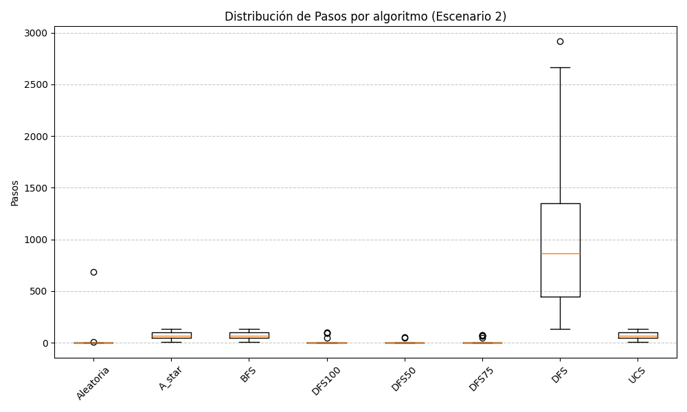 
  <b>Figura 8:</b> Boxplot de pasos realizados del escenario 2

---

### 3.3 Boxplots de Costo Total

- En el **escenario 1**, todos los algoritmos que logran encontrar soluciones válidas reportan costos similares, ya que en este escenario el costo de cada movimiento es uniforme y directamente proporcional al número de pasos necesarios para alcanzar el objetivo. Esto significa que, aunque los algoritmos difieran en la cantidad de nodos explorados, la solución final en términos de costo tiende a ser equivalente. La excepción es DFS, que en algunos casos puede desviarse hacia ramas largas o no óptimas, generando soluciones con mayor número de pasos y, por ende, mayor costo en comparación con los demás algoritmos.

- En el escenario 2, también se observa que los algoritmos BFS, A* y UCS presentan costos muy similares. Esto se debe a que la estructura del escenario permite que las rutas más cortas y de menor costo sean detectadas de manera eficiente por estos algoritmos. Como se puede ver en la figura 9, los resultados prácticamente se superponen, indicando que a pesar de las diferencias en estrategia de búsqueda (BFS explora por niveles, UCS minimiza el costo acumulado y A* utiliza heurística), todos terminan encontrando rutas equivalentes en términos de costo.

- En general, esto demuestra que la elección de algoritmo impacta más en la cantidad de explorados y en la eficiencia computacional que en el costo final, siempre que el algoritmo logre encontrar una solución válida. A* destaca por encontrar la solución óptima explorando menos nodos, mientras que BFS y UCS garantizan optimalidad pero con mayor exploración.

  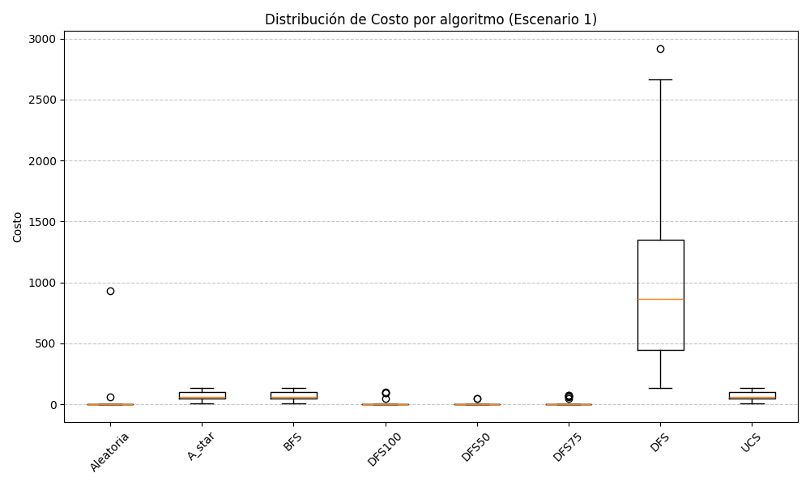 
  <b>Figura 9:</b> Boxplot de costo de la solución del escenario 1

  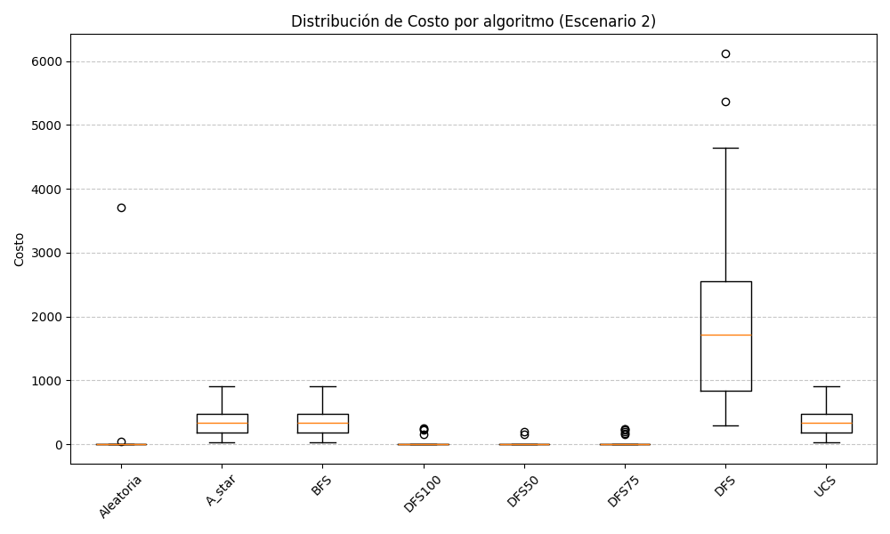 
  <b>Figura 10:</b> Boxplot de costo de la solución del escenario 2

  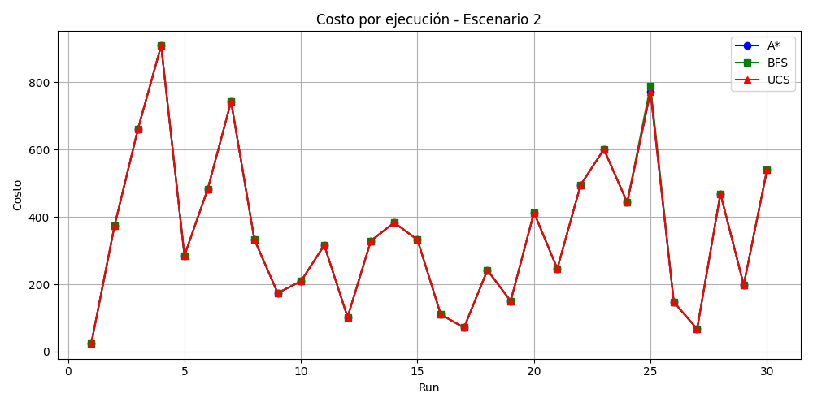 
  <b>Figura 11:</b> Gráfico de costo de la solución del escenario 2 para A*, BFS y UCS

---

### 3.4 Boxplots de Tiempo de Ejecución

 - BFS y UCS son los que consumen más tiempo de ejecución porque exploran una gran cantidad de estados antes de encontrar la solución. BFS revisa todos los nodos por niveles, y UCS evalúa rutas buscando minimizar el costo acumulado, lo que aumenta significativamente la cantidad de nodos visitados y, por ende, el tiempo de cómputo.

- A* presenta un tiempo de ejecución balanceado. Gracias a la heurística (en este caso, la distancia Manhattan), prioriza los nodos más prometedores, evitando explorar ramas irrelevantes y reduciendo la cantidad de nodos visitados respecto a BFS y UCS, sin comprometer la optimalidad de la solución.

- DFS es ligeramente más rápido que BFS y UCS, porque se adentra en una rama antes de retroceder, lo que reduce la exploración de nodos. Sin embargo, es poco confiable, ya que puede desviarse hacia ramas largas o sin salida y, por lo tanto, no siempre encuentra la solución óptima o incluso alguna solución en escenarios complejos.

- Los algoritmos DLS son mucho más rápidos que DFS gracias a las imposiciones de límites de profundidad. Esto evita que los algoritmos explore ramas demasiado largas o sin salida, pero como consecuencia encuentran muchas menos soluciones que los algoritmos completos (exceptuando la búsqueda aleatoria). Su eficiencia viene a costa de no garantizar soluciones en todos los escenarios.

- Búsqueda aleatoria es la más rápida en tiempo de ejecución, porque selecciona los nodos de forma aleatoria y siempre explora como máximo 1000 estados. Esto limita la exploración total del espacio, reduciendo el tiempo de cómputo, pero a costa de una muy baja probabilidad de encontrar soluciones, especialmente en escenarios grandes o con obstáculos.

  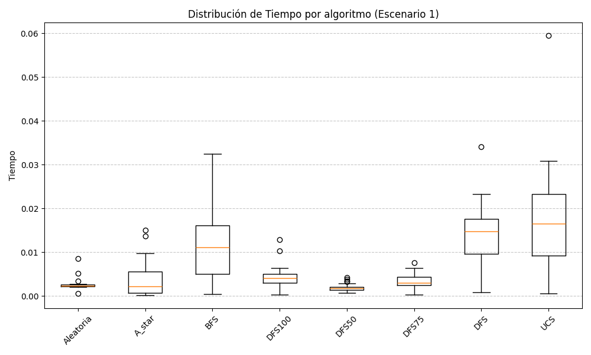 
  <b>Figura 12:</b> Boxplot de tiempo de ejecución del escenario 1

   
  <b>Figura 13:</b> Boxplot de tiempo de ejecución del escenario 2

  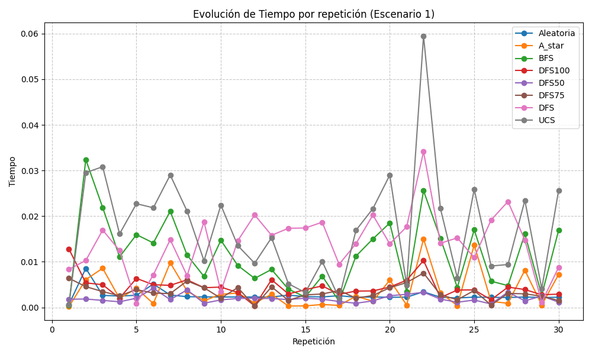 
  <b>Figura 14:</b> Gráfico de tiempo de ejecución del escenario 1

  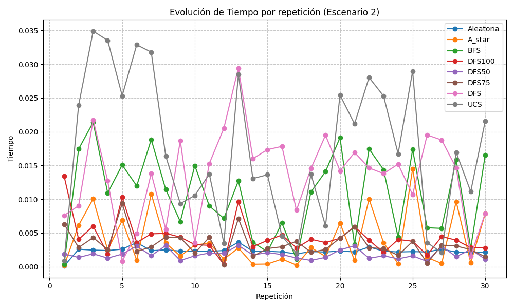 
  <b>Figura 15:</b> Gráfico de tiempo de ejecución del escenario 2

---

### 3.5 Gráfico Lineal Comparativo (Costo por Repetición)

  
- UCS, A* y BFS muestran resultados estables y consistentes.  
- DFS y DLS presentan mayor variabilidad, dependiendo de la estructura del entorno.  
- La búsqueda aleatoria es caótica y nunca consistente.  

  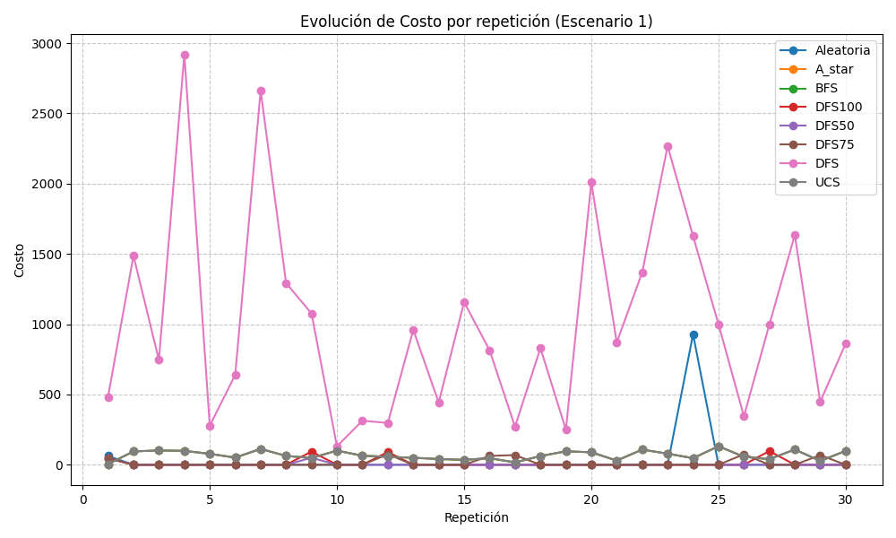 
  <b>Figura 16:</b> Gráfico de costo por ejecución del escenario 1

  

  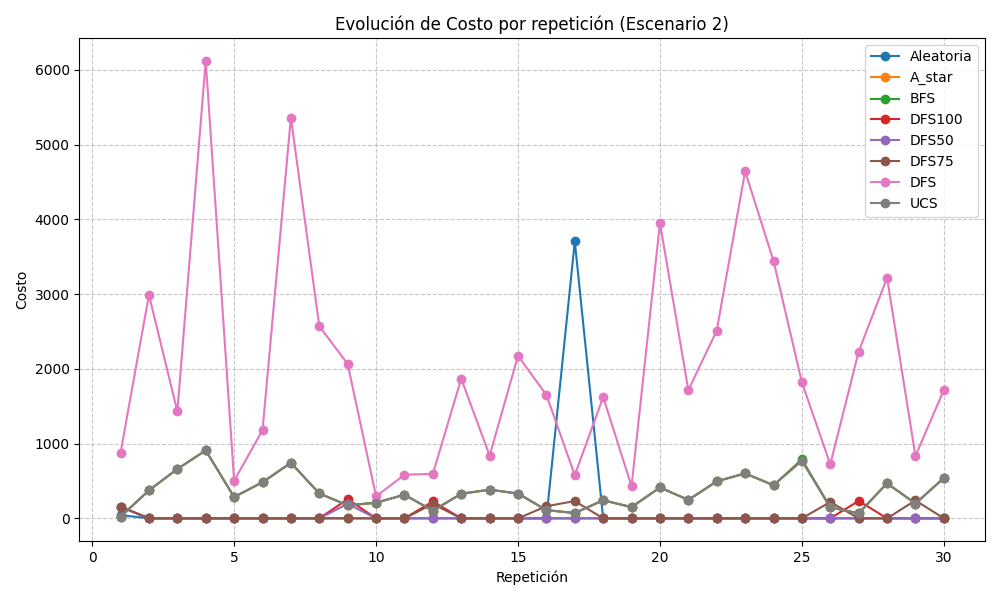 
  <b>Figura 17:</b> Gráfico de costo por ejecución del escenario 2

---

## 4. Conclusiones
- **BFS** y **UCS** son eficientes en costo pero tienen una alta cantidad de estados explorados.
- **DFS** es rápido pero no confiable, muchas veces no encuentra solución.  
- **DLS** hereda las limitaciones de DFS, aunque introduce cortes útiles.  
- **UCS** y **A*** son los más adecuados cuando se consideran **costos diferenciados**, siendo **A*** más eficiente ya que explora una menor cantidad de estados, ahorrando tiempo de ejecución y uso de memoria.
- **Búsqueda aleatoria** solo sirve como comparación de base, pero es ineficiente y no aplicable en práctica.  

En resumen:
- A*, UCS y BFS son eficientes en términos de costo.
- A* es el algoritmo más eficiente en cuanto a estados explorados y costo, si se elige una heurística adecuada.

---
