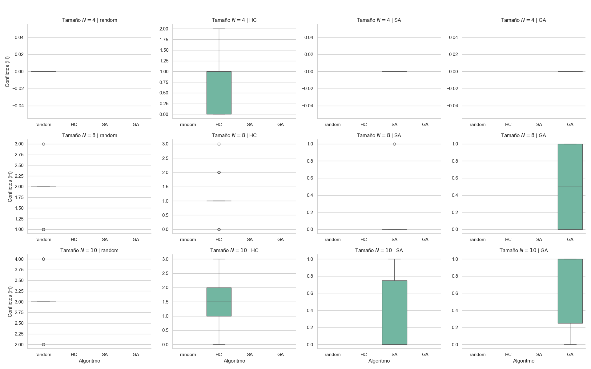
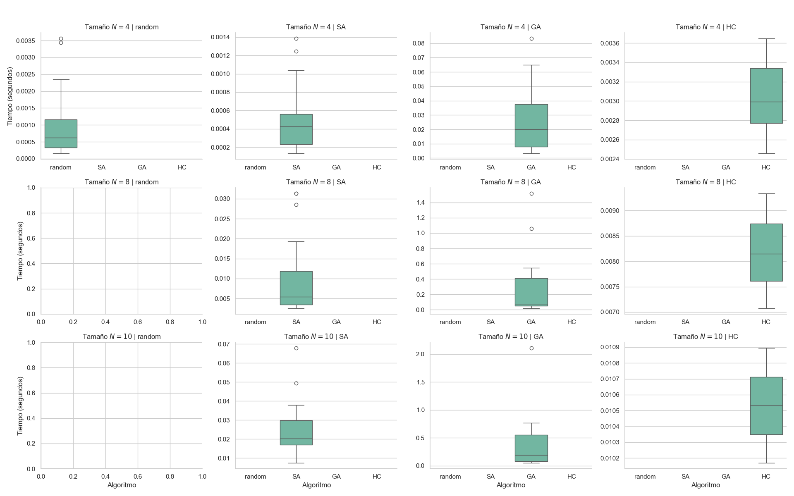
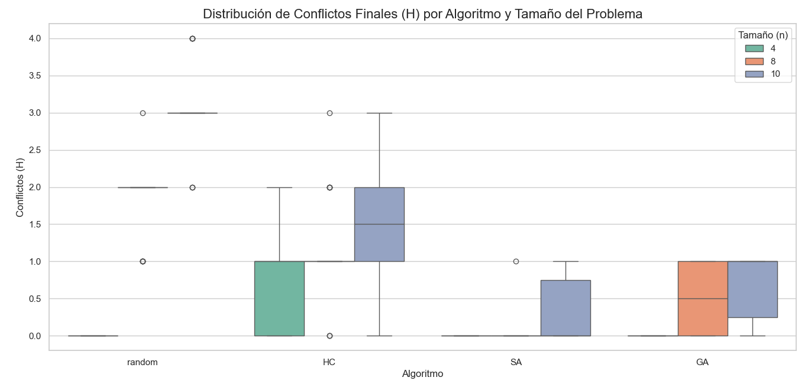
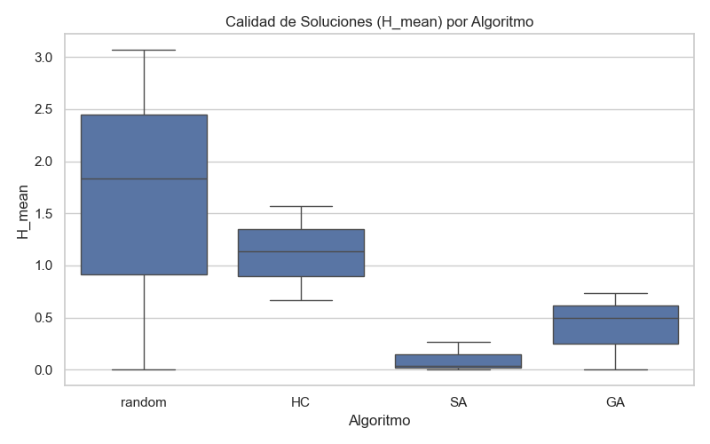
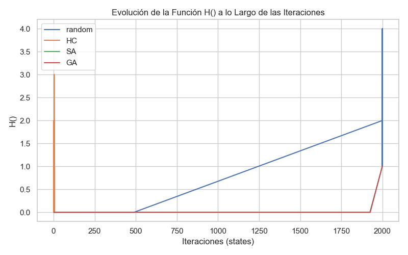
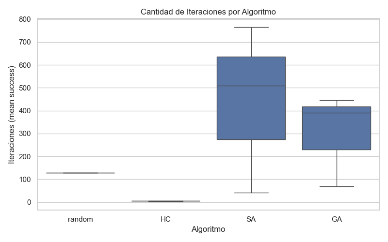
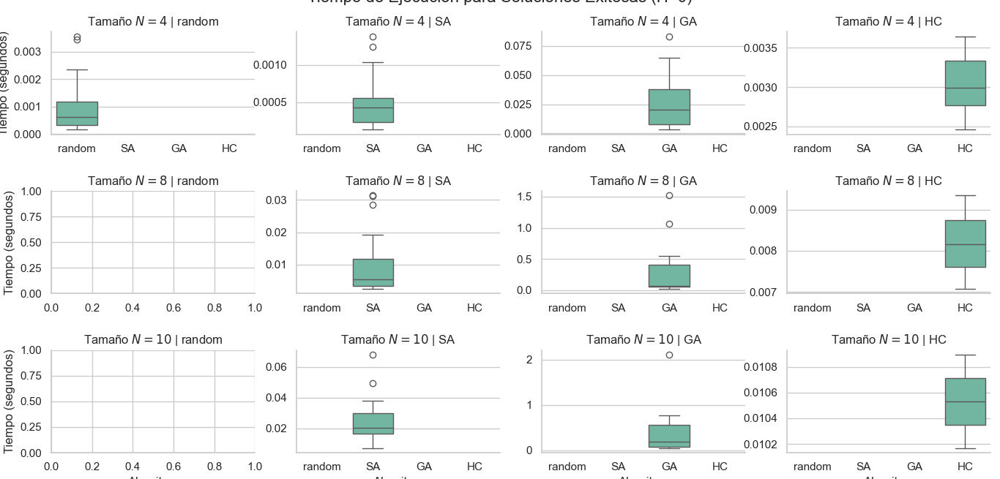

# Informe Comparativo de Algoritmos para el Problema de las N-Reinas

## 1. Introducción

El problema de las N-reinas consiste en ubicar N reinas en un tablero de ajedrez de tamaño N×N
de manera que ninguna se ataque entre sí, es decir, que no compartan la misma fila, columna o
diagonal. Este problema es un clásico de la inteligencia artificial y la optimización combinatoria,
debido a la gran cantidad de configuraciones posibles y la necesidad de estrategias heurísticas
para alcanzar soluciones eficientes. En el presente trabajo se evaluaron tres algoritmos de
búsqueda y optimización aplicados al problema: Hill Climbing (HC), Simulated Annealing (SA) y
Algoritmo Genético (GA). El objetivo es determinar cuál de ellos resulta más adecuado,
considerando la calidad de las soluciones obtenidas, la tasa de éxito y el tiempo de ejecución.

## 2. Métricas evaluadas
Los experimentos se realizaron sobre tableros de distintos tamaños (N = 4, 8, 10, etc.), ejecutando múltiples corridas independientes por algoritmo.
Para cada ejecución se registraron los siguientes indicadores:

1. **H**: número de conflictos entre reinas (H = 0 indica solución válida).

2. **pct_solved**: porcentaje de ejecuciones que alcanzaron una solución válida.

3. **time_mean_success**: tiempo promedio (en segundos) de las ejecuciones exitosas.

4. **states_mean_success**: cantidad promedio de estados explorados hasta la solución.

Cabe destacar dos aspectos metodológicos relevantes:

- En el caso del Simulated Annealing, el algoritmo fue forzado a realizar hasta 2000 iteraciones por ejecución, incluso si la temperatura mínima había sido alcanzada. Esto garantizó una exploración más exhaustiva del espacio de búsqueda, permitiendo una mayor tasa de éxito. Sin este cambio el algoritmo llegaba como máximo a 680 estados, momento donde llegaba a la temperatura mínima.

- En el Algoritmo Genético, la población inicial se generó como copias del mismo estado para cada semilla aleatoria, lo que redujo la diversidad inicial y afectó negativamente la capacidad del algoritmo para explorar soluciones distintas. Esta modificación se hizo con el fin de intentar inicializar todos los algoritmos en un mismo estado.

## 3. Resultados Obtenidos

| Algoritmo                    | % de tableros resueltos | Conflictos promedio (H_mean) | Tiempo promedio (s) | Estados explorados |
| ---------------------------- | ----------------------- | ---------------------------- | ------------------- | ------------------ |
| **Hill Climbing (HC)**       | 17.8 %                  | 1.12                         | **0.007 s**         | **≈ 5**            |
| **Simulated Annealing (SA)** | **90.0 %**              | **0.10**                     | 0.011 s             | 438                |
| **Genetic Algorithm (GA)**   | 58.9 %                  | 0.41                         | 0.278 s             | 302                |

## 4. Análisis Comparativo

   
  <b>Figura 1:</b> Boxplot de conflictos (valor H) de la solución por tamaño y algoritmo

   
  <b>Figura 2:</b> Boxplot de tiempo de ejecución para casos en los que se encontró solución (valor H = 0)

   
  <b>Figura 3:</b> Distribución de conflictos por algoritmo y tamaño del problema

   
  <b>Figura 4:</b> Gráfico de (valor H/cantidad de conflictos) promedio de la solución

   
  <b>Figura 5:</b> Gráfico de función H 

   
  <b>Figura 6:</b> Boxplot de iteraciones por algortimo

   
  <b>Figura 7:</b> Boxplot de tiempo de ejecución para soluciones encontradas

- **Hill Climbing (HC):**
Es el algoritmo más simple y rápido, pero presenta una alta tendencia a quedar atrapado en óptimos locales. Su baja tasa de éxito (≈ 18 %) refleja esta limitación, ya que no incorpora mecanismos de escape ni exploración aleatoria. Por ello, aunque eficiente en tiempo, no es confiable para instancias de mayor tamaño.

- **Simulated Annealing (SA):**
Este método se destaca por su excelente balance entre eficiencia y robustez.
La introducción del parámetro de temperatura le permite aceptar temporalmente soluciones peores, facilitando la salida de óptimos locales.
En este experimento, al forzarse el algoritmo a realizar 2000 iteraciones por corrida, incluso después de alcanzar la temperatura mínima, se observó una mejora significativa en la tasa de éxito (90 %) y en la calidad de las soluciones.
El tiempo de ejecución sigue siendo muy bajo, lo que lo convierte en una opción óptima para este tipo de problema.

-  **Algoritmo Genético (GA):**
A pesar de su diseño evolutivo y su capacidad teórica de exploración, el rendimiento se vio afectado por una población inicial poco diversa (todas las copias de un mismo estado para cada semilla).
Esto redujo la efectividad de la recombinación y la mutación, provocando convergencia prematura.
Además, su costo computacional es considerablemente mayor sin ofrecer mejoras equivalentes en rendimiento.

## 5. Conclusiones

De acuerdo con los resultados y las condiciones experimentales establecidas, se concluye que el algoritmo Simulated Annealing (SA) es el más adecuado para resolver el problema de las N-reinas.

- Presenta la mayor tasa de éxito (≈ 90 %) y soluciones de alta calidad.

- Mantiene tiempos de ejecución reducidos.

- Su comportamiento se beneficia especialmente de la extensión del número de iteraciones, lo que refuerza su capacidad exploratoria frente a otros métodos deterministas.

En cambio:

- Hill Climbing resulta demasiado susceptible a los óptimos locales.

- El Algoritmo Genético, aunque potencialmente poderoso, vio comprometido su desempeño por la baja diversidad inicial y su mayor costo de cómputo.

Por lo tanto, Simulated Annealing se considera la técnica más eficiente y efectiva para la resolución del problema de las N-reinas bajo las condiciones evaluadas.