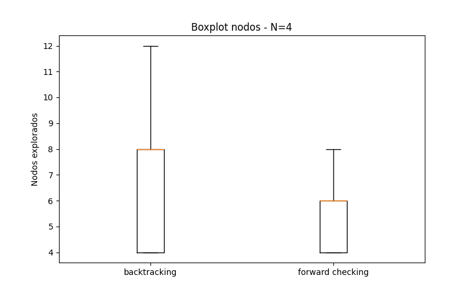
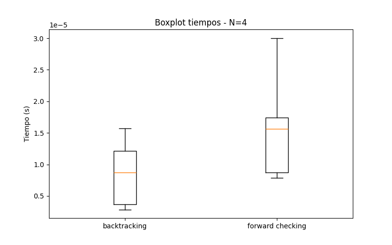
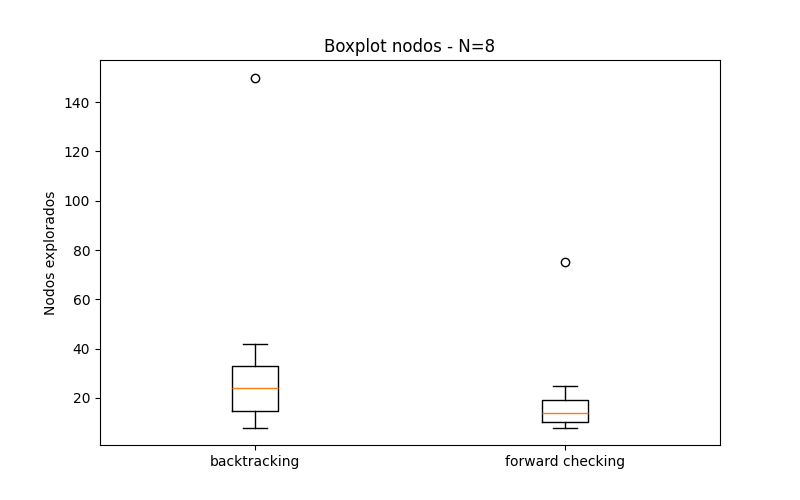
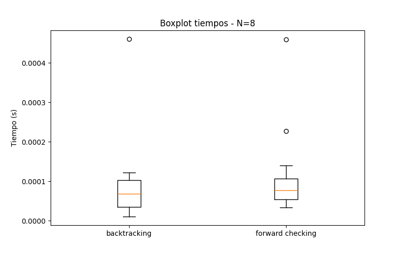
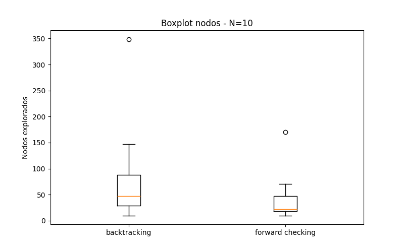
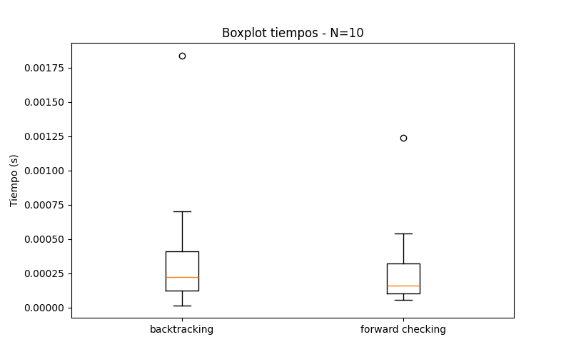
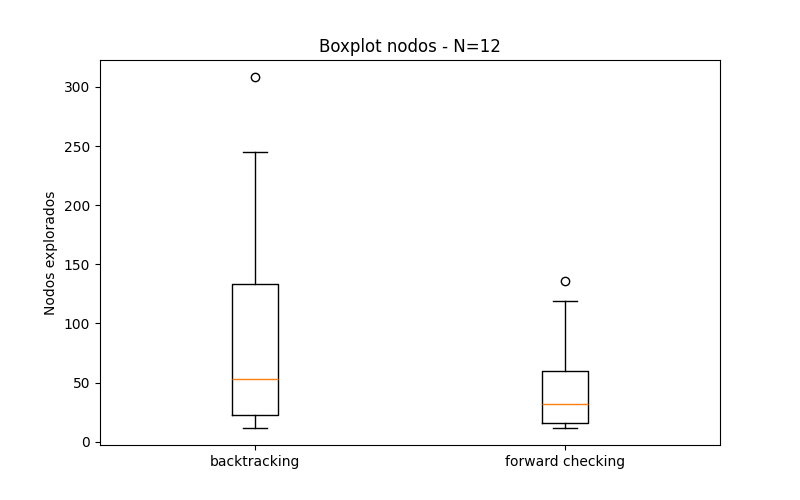
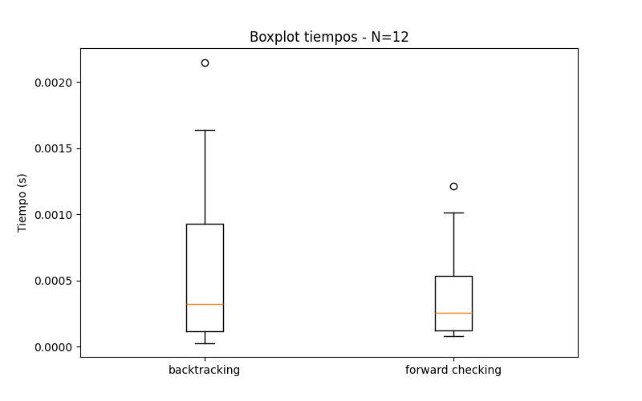
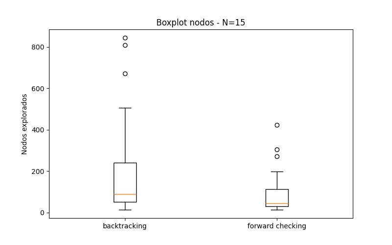
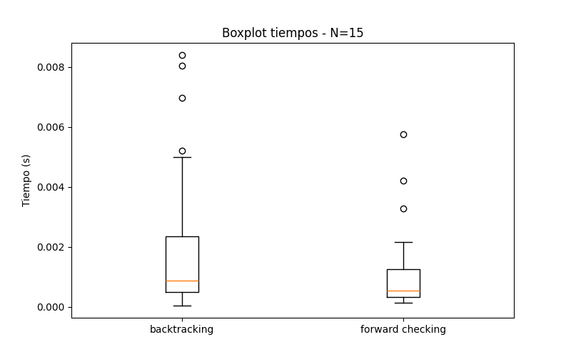

# Informe Comparativo de Algoritmos para el Problema de las N-Reinas

## 1. Introducción

El problema de las N-reinas consiste en ubicar N reinas en un tablero de tamaño N×N de manera que ninguna se ataque entre sí, evitando compartir la misma fila, columna o diagonal. Se trata de un problema clásico dentro de la inteligencia artificial, la optimización combinatoria y la teoría de búsqueda, debido a su elevado espacio de estados y a la necesidad de técnicas eficientes para encontrar soluciones sin conflictos.

En este trabajo se analizaron dos grupos de algoritmos aplicados al problema:

- **Algoritmos clásicos de Consistencia de Restricciones (CSP):**
  - Backtracking  
  - Forward Checking  

- **Algoritmos metaheurísticos:**
  - Hill Climbing (HC)  
  - Simulated Annealing (SA)  
  - Algoritmo Genético (GA)  
  - Random Search  

El objetivo es determinar cuál de ellos resulta más adecuado según diversos criterios: calidad de solución, consistencia de resultados, tiempo de ejecución y cantidad de nodos o estados explorados.

---

## 2. Métricas evaluadas

Los experimentos se ejecutaron múltiples veces para distintos valores de N, utilizando varias semillas aleatorias.  
En cada ejecución se registraron los siguientes indicadores:

1. **success**: indica si se alcanzó una solución válida (H = 0).  
2. **pct_solved**: porcentaje de ejecuciones que encontraron solución.  
3. **time_mean_success**: tiempo promedio para las ejecuciones exitosas.  
4. **nodes_mean / states_mean**: número promedio de nodos o estados explorados.  
5. **H**: número de conflictos en la solución final.

Aspectos metodológicos importantes:

- **Los algoritmos CSP (Backtracking y Forward Checking) siempre encuentran una solución** para estos valores de N, y lo hacen explorando muy pocos nodos gracias a la poda y la verificación anticipada de restricciones.

- **Simulated Annealing (SA)** fue ejecutado con un número fijo de 2000 iteraciones para asegurar una exploración más amplia incluso si se alcanzaba tempranamente la temperatura mínima.

- **En el Algoritmo Genético**, la población inicial fue generada como copias del mismo individuo por semilla, reduciendo la diversidad inicial y afectando la capacidad exploratoria.

---

## 3. Resultados Obtenidos

### 3.1 Algoritmos CSP (Backtracking y Forward Checking)
*(extraídos de `nqueens_results.csv`)*

| Algoritmo           | % de tableros resueltos | Tiempo promedio (s) | Nodos explorados |
|--------------------|--------------------------|----------------------|-------------------|
| **Backtracking**       | 100 %                     | 0.00059 s            | 76.6             |
| **Forward Checking**   | **100 %**                 | **0.00036 s**        | **37.4**         |

### 3.2 Metaheurísticos
*(extraídos de `experiments_results.csv`)*

| Algoritmo                    | % de tableros resueltos | H promedio | Tiempo promedio (s) | Estados explorados |
|-----------------------------|--------------------------|-----------|---------------------|---------------------|
| **Hill Climbing (HC)**       | 17.8 %                  | 1.12      | **0.007 s**         | **≈ 5**             |
| **Simulated Annealing (SA)** | **90.0 %**              | **0.10**  | 0.011 s             | 438                 |
| **Algoritmo Genético (GA)**  | 58.9 %                  | 0.41      | 0.278 s             | 302                 |
| **Random Search**            | 0–10 % aprox.           | Alto      | 0.019 s             | 1376                |

---

## 4. Análisis Comparativo

   
  <b>Figura 1:</b> Boxplot de nodos explorados para n=4 en foward checking y backtracking

   
  <b>Figura 2:</b> Boxplot de tiempo de ejecución para n=4 en foward checking y backtracking

   
  <b>Figura 3:</b> Boxplot de nodos explorados para n=8 en foward checking y backtracking

   
  <b>Figura 4:</b> Boxplot de tiempo de ejecución para n=8 en foward checking y backtracking

   
  <b>Figura 5:</b> Boxplot de nodos explorados para n=10 en foward checking y backtracking

   
  <b>Figura 6:</b> Boxplot de tiempo de ejecución para n=10 en foward checking y backtracking

   
  <b>Figura 7:</b> Boxplot de nodos explorados para n=12 en foward checking y backtracking

   
  <b>Figura 8:</b> Boxplot de tiempo de ejecución para n=12 en foward checking y backtracking

   
  <b>Figura 9:</b> Boxplot de nodos explorados para n=15 en foward checking y backtracking

   
  <b>Figura 10:</b> Boxplot de tiempo de ejecución para n=15 en foward checking y backtracking

### **Backtracking y Forward Checking (CSP)**

- Ambos algoritmos fueron **los más rápidos del conjunto**.  
- Forward Checking redujo aproximadamente a la mitad los nodos explorados respecto de Backtracking.  
- Debido a que incorporan poda sistemática, resolvieron el 100% de los casos sin aleatoriedad.  
- Son ideales para tamaños moderados de N.

---

### **Hill Climbing**

- El más rápido entre los metaheurísticos.  
- Sin embargo, sufre fuertemente los **óptimos locales**, mostrando una tasa de éxito < 20 %.  
- Explora muy pocos estados (≈ 5), lo que explica su falta de robustez.

---

### **Simulated Annealing (SA)**

- Logró la **mayor tasa de éxito (≈ 90%)** entre los metaheurísticos.  
- El mecanismo de temperatura le permite escapar de óptimos locales.
- El ajuste de permitir **2000 iteraciones por corrida** mejoró significativamente la calidad de las soluciones.  
- Mantiene tiempos bajos y una alta estabilidad.

---

### **Algoritmo Genético (GA)**

- Rendimiento moderado en éxito (≈ 60%) y calidad de solución.  
- Tiempo considerablemente mayor debido al manejo de poblaciones.  
- La baja diversidad inicial perjudicó su capacidad exploratoria.

---

### **Random Search**

- Evalúa muchos estados sin dirección.  
- Tiempo razonable pero soluciones pobres y éxito casi nulo.  
- Solo sirve como baseline, no como estrategia viable.

---

## 5. Conclusiones

Considerando los resultados obtenidos y las características de cada método:

- **Para N pequeño y mediano**, los algoritmos CSP (Backtracking y Forward Checking) son los más efectivos, resolviendo siempre el problema con tiempos extremadamente bajos.

- **Entre los metaheurísticos, Simulated Annealing se destaca como el método más eficiente y robusto**, logrando:
  - la mayor tasa de éxito (≈ 90 %),  
  - la mejor calidad de solución (H≈0),  
  - tiempos bajos y estables,  
  - capacidad de escape frente a óptimos locales.

- **Hill Climbing**, aunque rápido, no resulta confiable por su baja tasa de éxito.  
- **El Algoritmo Genético** mostró un rendimiento aceptable pero subóptimo, afectado por la pobre diversidad inicial y su mayor costo computacional.  
- **Random Search** se descarta como estrategia válida para este problema.

Simulated Annealing (SA) mostró el mejor equilibrio entre tiempo de ejecución, estabilidad en la calidad de las soluciones y cantidad reducida de nodos/estados explorados.
Este rendimiento se explica en parte por su estrategia de búsqueda estocástica con enfriamiento, que permite escapar de mínimos locales sin requerir una exploración exhaustiva del espacio.

Es importante destacar que, en este experimento, se forzó al algoritmo a completar las 2000 iteraciones incluso cuando la temperatura mínima hubiera frenado la búsqueda antes. Esta modificación favorece la comparación pero también impacta directamente en los tiempos registrados.
Aun así, Simulated Annealing mantuvo un desempeño consistentemente superior al de otros métodos heurísticos evaluados.

Entre los métodos deterministas, Forward Checking presentó:

- Menores tiempos de ejecución promedio.

- Menor variabilidad entre corridas.

- Cantidad muy baja de nodos explorados.

- 100% de éxito en la búsqueda de soluciones.

La clave de su eficiencia es la combinación de propagación temprana de restricciones y poda anticipada, lo que reduce drásticamente el espacio de búsqueda.
En contraste, algoritmos como Backtracking simple o Backtracking + MRV presentan un crecimiento exponencial del espacio explorado cuando N aumenta.

En conclusión, bajo las condiciones evaluadas:
- Simulated Annealing es el mejor metaheurístico en los escenarios evaluados, debido a su excelente equilibrio entre rendimiento, estabilidad y capacidad de llegar a soluciones sin explorar de forma exhaustiva el espacio de búsqueda.

- Forward Checking es el algoritmo clásico más eficiente y el que mejor escala, obteniendo sistemáticamente los mejores tiempos y la menor cantidad de nodos explorados, sin sacrificar exactitud.

Ambos algoritmos representan enfoques sólidos y complementarios:

- Simulated Annealing  es útil para exploración eficiente sin garantías formales pero con muy buenos resultados prácticos.

- Forward Checking es útil para resolver exactamente el problema con rapidez gracias a un manejo inteligente de restricciones.

En conjunto, estos resultados brindan una visión clara del comportamiento de diferentes técnicas de resolución de N-Reinas y permiten fundamentar decisiones de diseño en trabajos futuros, especialmente en contextos donde eficiencia y estabilidad son factores críticos.

