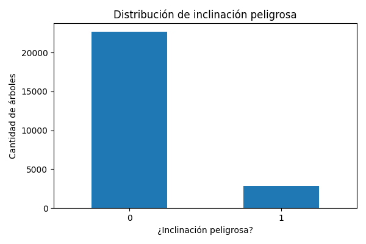
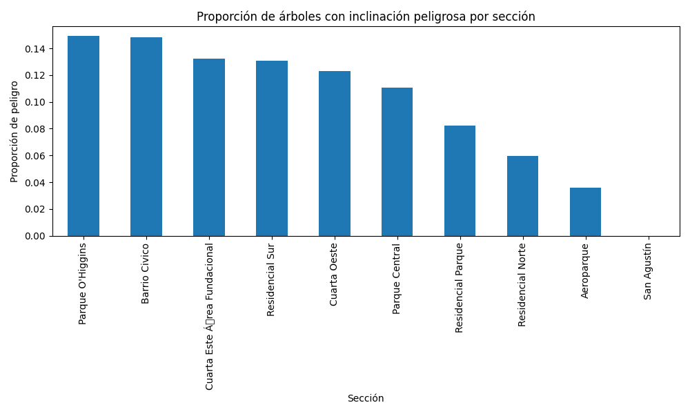
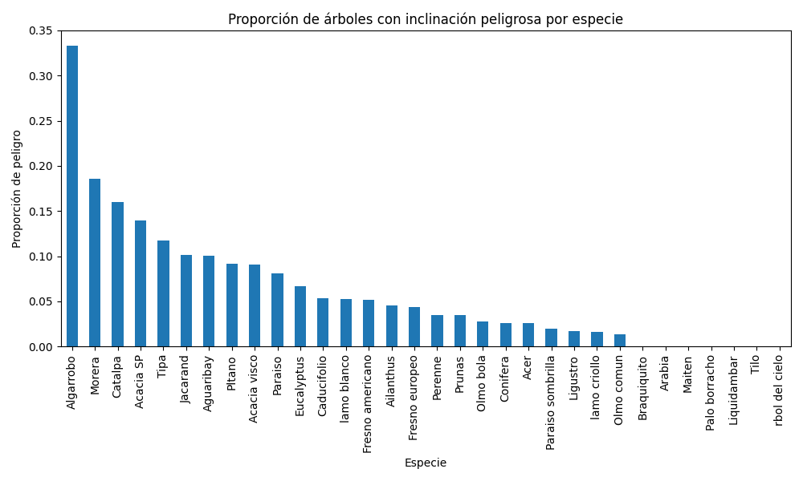
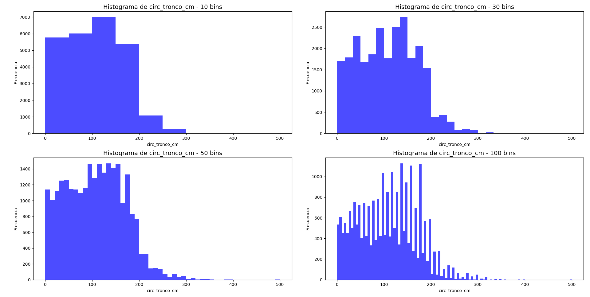
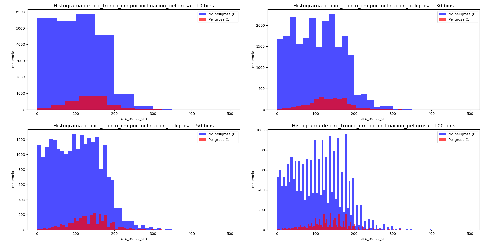

# Respuestas ejercicio 2

### a) ¿Cuál es la distribución de las clase inclinacion_peligrosa?

Se puede observar que hay más inclinaciones no peligrosas en comparación a las peligrosas. 
- No peligrosos: Entre 22000 a 23000 árboles
- Peligrosos: Alrededor de 2500

### b) ¿Se puede considerar alguna sección más peligrosa que otra?

Se puede considerar que la sección "San Agustín" es la menos peligrosa entre las demás y, además, entre las secciones más
peligrosas se destacan: 
- "Parque O'Higgins"
- "Barrio Cívico"
- "Cuarta Este Área Fundacional"

Siendo "Parque O'Higgins" la sección más peligrosa. 

### c) ¿Se puede considerar alguna especie más peligrosa que otra?

Se puede ver que la especie "Algarrobo" tiende a tener una mayor inclinación y, por lo tanto, ser una especie más 
peligrosa que las demás. Al contrario, la especie "Árbol del cielo" es la que tiene, en general, una menor inclinación, siendo 
la especie más segura.

# Gráficos ejercicio 3

Bins utilizados = [10, 30, 50, 100]

#### Histogramas de circunferencias de tronco por bins 

  

#### Histogramas de circunferencias de tronco por bins por clase

